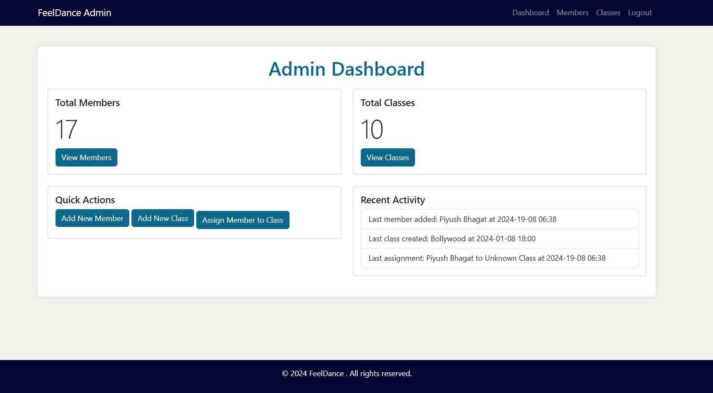
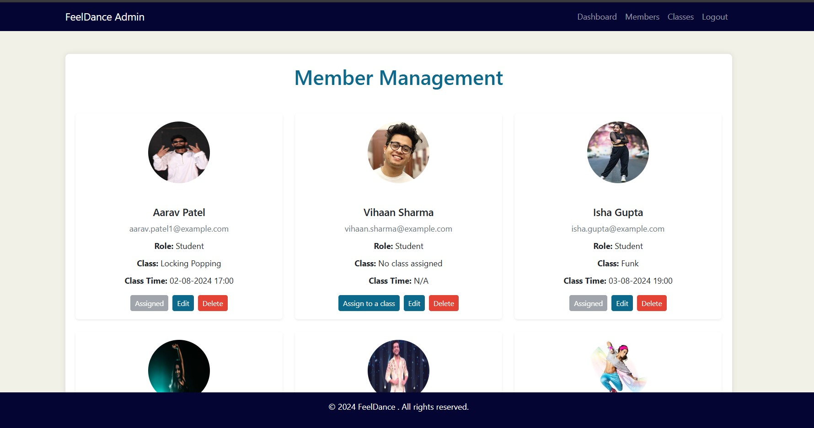
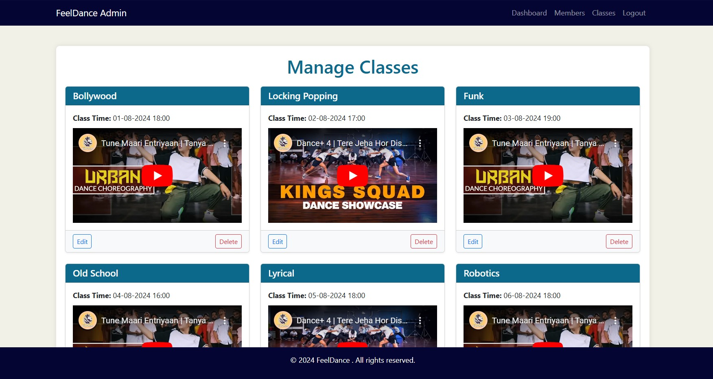
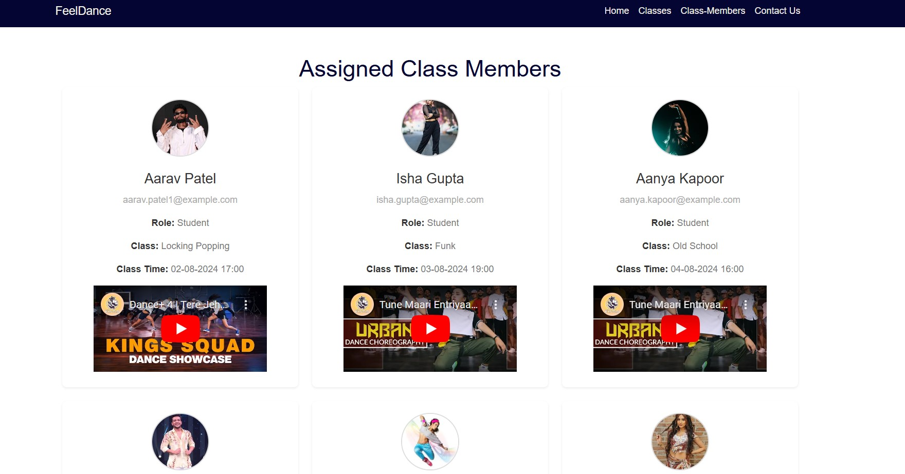

# FeelDance-Laravel

## Introduction

FeelDance System is a web application developed to streamline the management of dance classes and members within a dance academy. The system allows administrators to efficiently manage class schedules, member profiles, and class assignments. The user-friendly interface ensures both administrators and members can easily interact with the system's features.

## Features and Database Schema

### Admin Side

1. **Admin Dashboard**:
   - Provides an overview of key statistics, including total members and classes.
   - Quick access to managing members, classes, and allocations.

2. **Member Management**:
   - Admins can create, edit, view, and delete member profiles.
   - Members can be assigned to classes and have roles such as student or instructor.
   - Profile images are managed within the system for easy identification.

3. **Class Management**:
   - Admins can create, edit, view, and delete classes.
   - Each class includes a name, schedule, and an optional YouTube video link to provide instructional content.

4. **Class Allocation**:
   - Admins can assign members to classes and track these allocations.
   - The allocation status of each member is clearly displayed.

5. **Recent Activity**:
   - Admins can view recent activities, such as new members added and classes created.

### User Side

1. **User Profile**:
   - Members can view their profiles, including their assigned classes and roles.
   - Profile images are displayed for easy identification.

2. **Class Information**:
   - Members can view details of their assigned classes, including class name, schedule, and the related instructional video.
   - Members can watch the class videos linked via YouTube.

### Database Schema

- **Members**: Stores information about the members of the academy, including their name, email, role, profile image, and class assignment.
- **Classes**: Stores details about the classes offered by the academy, including the class name, schedule, and an optional YouTube video link.
- **Allocations**: Manages the relationships between members and classes, tracking which members are assigned to which classes.

## User Flow Screenshots

1. **Admin Dashboard**: Overview of members and classes.
   

2. **Member Management**: Admins manage member details and class assignments.
   

3. **Class Management**: Admins manage class details, including schedules and videos.
   

4. **User Profile**: Members view their profile, class assignments, and role.
   

## Project Completion

This project was completed successfully, with all intended features fully implemented. The system allows for the effective management of a dance academy, from member registration to class scheduling and allocation. Each feature was carefully developed and tested to ensure a seamless user experience.

## Thoughts on Laravel

Laravel proved to be a powerful and efficient framework for developing this project. The built-in tools, such as Eloquent ORM for database management and Blade templating engine for views, greatly streamlined the development process. Laravel's robust documentation and community support also made it easier to solve challenges encountered during development. Overall, this project has solidified my understanding of Laravel, and I look forward to exploring more advanced features in future projects.

## Installation and How to Run

### Prerequisites

Before you begin, ensure you have the following installed on your system:

- PHP 8.0 or higher
- Composer
- MySQL
- A web server (e.g., Apache, Nginx, or Laravel's built-in server)

### Steps to Install and Run

1. **Clone the Repository**:
   ```bash
   git clone https://github.com/Karishma271/FeelDance-Laravel.git
 
